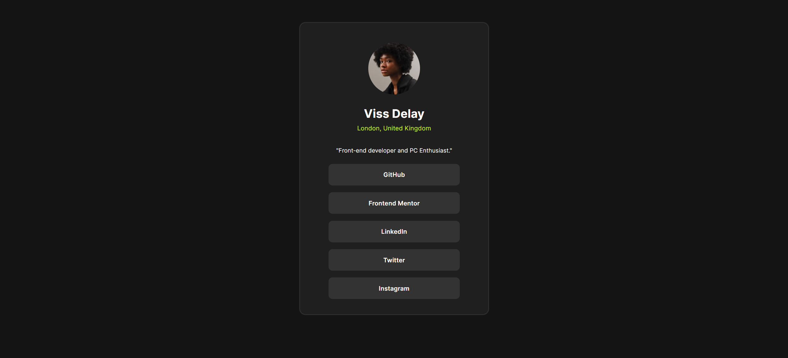

# Frontend Mentor - Social links profile solution
## Table of contents

- [Overview](#overview)
  - [The challenge](#the-challenge)
  - [Screenshot](#screenshot)
  - [Links](#links)
- [My process](#my-process)
  - [Built with](#built-with)
  - [What I learned](#what-i-learned)
  - [Continued development](#continued-development)
  - [Useful resources](#useful-resources)
- [Author](#author)
- [Acknowledgments](#acknowledgments)

## Overview
- A very simple project that doesn't require much besides basic HTML and some CSS + Flex.

### The challenge
Users should be able to:
- See hover and focus states for all interactive elements on the page
- Done✅

### Screenshot

### Links
- Solution URL: [Add solution URL here](https://github.com/Vissdelay/social-links)
- Live Site URL: [Add live site URL here](https://vissdelay.github.io/social-links)

## My process
- It mostly started off slow as I work my way down.
- Layout and responsiveness was a problem for me since i have a 14-inch display, so it was hard to determine how it should look on bigger screen.
- I got stuck because I thought using too many Div elements would make it look bad. But the process afterwards are mostly smooth.

### Built with
- HTML 5
- CSS 3
- CSS Flexbox
- External font files

### What I learned

- Using mobile phones with live server to check for responsiveness on mobile.
- It was a lot easier once you start doing with what you know, although of course it can be done better.

### Continued development
- Definitely looking to use grid more often.
- If there is a better way than div, I would try.

### Useful resources
- This task didn't need much help apparently.

## Author
- Website - [VissDelay](https://www.github.com/VissDelay)
- Frontend Mentor - [@VissDelay](https://www.frontendmentor.io/profile/VissDelay)
